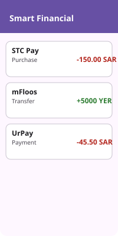
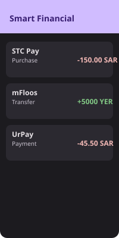
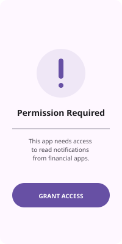

<p align="center">
  
</p>

<h1 align="center">Smart Financial Tracker</h1>

<p align="center">
  
  
  
  
</p>

<p align="center">
  <b>Professional Android library for secure, dynamic transaction parsing.</b><br>
  Designed for speed, privacy, and extensive regional support (Yemen & Gulf).
</p>

---

[English](#english) | [العربية](#arabic)

---

## 📱 Showcase

<table align="center">
  <tr>
    <td align="center"><b>Dashboard (Light)</b></td>
    <td align="center"><b>Dashboard (Dark)</b></td>
    <td align="center"><b>Permission Guide</b></td>
  </tr>
  <tr>
    <td></td>
    <td></td>
    <td></td>
  </tr>
</table>

<p align="center">
  
  <br><i>Real-time notification parsing in action.</i>
</p>

---

<a name="english"></a>
## English

**Smart Financial Tracker** is a powerful Android library designed to simplify financial event tracking and parsing. It provides seamless integration for capturing transaction notifications and managing financial data securely.

### 🚀 Features
- **Notification Listener**: Automatically capture and parse financial SMS and app notifications.
- **Secure Storage**: Built-in AES encryption for sensitive financial data.
- **Flutter Support**: Ready-to-use Flutter plugin bridge for cross-platform integration.
- **Modular Design**: Easy to extend with custom parsers and data models.

### 📦 Installation
Add the following to your `build.gradle` (Module level):

```kotlin
dependencies {
    implementation("com.github.shehab-go:wallet-events:1.1.0")
}
```

### 🛠️ Quick Start
```kotlin
// Initialize the tracker client
val client = FinancialTrackerClient(context)
client.startListening()
```

### 📚 Documentation
For more detailed information, check our technical guides:
- [Technical Architecture](docs/architecture.md)
- [Security Deep Dive](docs/security-deep-dive.md)
- [Regional Support (Yemen & Gulf)](docs/regional-support.md)
- [Technical Contribution Guide](docs/CONTRIBUTING_GUIDE.md)
- [Project Roadmap](ROADMAP.md)

---

<a name="arabic"></a>
## العربية

**مُتتبع البيانات المالية الذكي (Smart Financial Tracker)** هي مكتبة أندرويد قوية مصممة لتسهيل تتبع وإدارة الأحداث المالية. توفر المكتبة تكاملاً سهلاً لالتقاط إشعارات المعاملات وإدارة البيانات المالية بأمان.

### 🚀 المميزات
- **مستمع الإشعارات**: التقاط وتحليل الرسائل القصيرة وإشعارات التطبيقات المالية تلقائياً.
- **تخزين آمن**: تشفير AES مدمج لحماية البيانات المالية الحساسة.
- **دعم فلاتر (Flutter)**: جسر برمجى جاهز للتكامل مع تطبيقات فلاتر.
- **تصميم معياري**: سهولة التوسع عبر إضافة أدوات تحليل (Parsers) ونماذج بيانات مخصصة.

### 📦 التثبيت
أضف الكود التالي إلى ملف `build.gradle` الخاص بالتطبيق:

```kotlin
dependencies {
    implementation("com.github.shehab-go:wallet-events:1.1.0")
}
```

### 🛠️ تشغيل سريع
```kotlin
// تهيئة العميل المتتبع
val client = FinancialTrackerClient(context)
client.startListening()
```

### 📚 التوثيق التقني
لمزيد من المعلومات التفصيلية، يرجى مراجعة الأدلة التقنية التالية:
- [الهندسة البرمجية للمشروع](docs/architecture.md)
- [دليل الأمان المتعمق](docs/security-deep-dive.md)
- [الدعم الإقليمي (اليمن والخليج)](docs/regional-support.md)
- [دليل المساهمة التقنية للمطورين](docs/CONTRIBUTING_GUIDE.md)
- [خارطة طريق المشروع](ROADMAP.md)

## 📄 License
This project is licensed under the Apache License 2.0 - see the [LICENSE](LICENSE) file for details.
