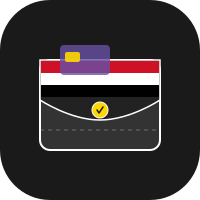

<p align="center">
  
</p>

<h1 align="center">Smart Financial Tracker (Yemen)</h1>

<p align="center">
  
  
  
  
  <a href="https://shehab-go.github.io/Smart-financial-tracker"></a>
</p>

<p align="center">
  <b>The ultimate Android library for tracking all Yemeni digital wallets and banks.</b><br>
  <b>المكتبة الأقوى لتتبع وإدارة كافة المحافظ الرقمية والبنوك اليمنية عبر نظام الأندرويد.</b><br>
  Secure, dynamic, and designed specifically for the Middle East financial ecosystem.
</p>

---

[English](#english) | [العربية](#arabic)

---

## 🇾🇪 Yemeni Financial Ecosystem Support | دعم النظام المالي اليمني

| Institution | المؤسسة | Status | الحالة |
| :--- | :---: | :--- | :--- |
| **Jeeb (جيب)** |  | ✅ Fully Supported | ✅ مدعوم بالكامل |
| **mFloos (الكريمي)** |  | ⏳ In Progress | ⏳ قيد التنفيذ |
| **ONE Cash** |  | ⏳ Planned | ⏳ مخطط له |
| **Jawali (جوالي)** |  | ⏳ Planned | ⏳ مخطط له |
| **Mobile Money** |  | ⏳ Planned | ⏳ مخطط له |
| **Mahfathati (محفظتي)** |  | ⏳ Planned | ⏳ مخطط له |

---

## 💻 Programming Languages & Platforms | لغات البرمجة والمنصات

| Language/Platform | اللغة / المنصة | Icon | Status | الحالة |
| :--- | :--- | :---: | :--- | :--- |
| **Kotlin (Android)** | **كوتلن (أندرويد)** |  | ✅ Fully Supported | ✅ مدعوم بالكامل |
| **Flutter** | **فلاتر** |  | ✅ Fully Supported | ✅ مدعوم بالكامل |
| **Swift (iOS)** | **سويفت (آيفون)** |  | ⏳ Planned | ⏳ مخطط له |
| **React Native** | **رياكت نيتف** |  | ⏳ Planned | ⏳ مخطط له |
| **Kotlin Multiplatform** | **كوتلن للمنصات المتعددة** |  | ⏳ Planned | ⏳ مخطط له |

---

<!--
## 📱 Showcase

<table align="center">
  <tr>
    <td align="center"><b>Dashboard (Light)</b></td>
    <td align="center"><b>Dashboard (Dark)</b></td>
    <td align="center"><b>Permission Guide</b></td>
  </tr>
  <tr>
    <td></td>
    <td></td>
    <td></td>
  </tr>
</table>

<p align="center">
  
  <br><i>Real-time notification parsing in action.</i>
</p>

---
-->
---

## 🏆 Real-world Success Stories | قصص نجاح واقعية

| App | Description | Link | Icon |
| :--- | :--- | :--- | :---: |
| **Daily Accounts** | **حسابات يومية** - تطبيق احترافي لإدارة الحسابات والديون. | <a href="https://play.google.com/store/apps/details?id=com.ramzi.debit_credit_app"></a> |  |

---

<a name="english"></a>
## English

**Smart Financial Tracker** is a powerful Android library designed to simplify financial event tracking and parsing. It provides seamless integration for capturing transaction notifications and managing financial data securely.

### 🚀 Features
- **Notification Listener**: Automatically capture and parse financial SMS and app notifications.
- **Secure Storage**: Built-in AES encryption for sensitive financial data.
- **Flutter Support**: Ready-to-use Flutter plugin bridge for cross-platform integration.
- **Modular Design**: Easy to extend with custom parsers and data models.

### 📦 Installation
Add the following to your `build.gradle` (Module level):

```kotlin
dependencies {
    implementation("com.github.shehab-go:wallet-events:1.1.0")
}
```

### 🛠️ Quick Start
```kotlin
// Initialize the tracker client
val client = FinancialTrackerClient(context)
client.startListening()
```

### 📚 Documentation
For more detailed information, check our technical guides:
- [📖 API Reference](https://shehab-go.github.io/Smart-financial-tracker)
- [Technical Architecture](docs/architecture.md)
- [Security Deep Dive](docs/security-deep-dive.md)
- [Regional Support (Yemen & Gulf)](docs/regional-support.md)
- [Technical Contribution Guide](docs/CONTRIBUTING_GUIDE.md)
- [Project Roadmap](ROADMAP.md)

---

## 🤝 How to Contribute | كيف تساهم

We welcome contributions from everyone! There are two main ways you can help:

### 1. For Developers: Adding New Parsers
The core of this library is the `DynamicParser`, which uses regex rules to extract data from notifications. You can contribute by adding support for new banks or wallets.

- **Explore rules:** Check [financial_tracker_config.json](file:///E:/Smartfinancialtracker/financial_tracker/src/main/assets/financial_tracker_config.json) to see existing patterns.
- **Add a rule:** Follow the structure in our [Technical Contribution Guide](file:///E:/Smartfinancialtracker/docs/CONTRIBUTING_GUIDE.md).
- **Test:** Use `FinancialTrackerClient.testParser()` to verify your regex against real notification text.

### 2. For Non-Developers: Help Us Collect Data
If you use a wallet that isn't supported yet, you can help us by providing sample notification data securely via our debug app.

**Currently Supported Apps for Capture:**
- **Jeeb (جيب)**, **mFloos (الكريمي)**, **ONE Cash (ون كاش)**
- **Mahfathati (محفظتي)**, **Mobile Money (موبايل موني)**, **Jawali (جوالي)**
- **Pando (باندو)**, **Yemen Wallet (محفظة اليمن)**, **SabaPay (Saba Islamic Bank)**
- **Shamil Mobile**, **YKB Mobile**, **IBY Mobile**, **Plus Cash**, **FastPay**, **Floosak**, **Wessal**

- **Download the APK:** [Download Latest Debug APK](https://github.com/shehab-go/smart-financial-tracker/releases) (or build the `:app` module).
- **Grant Permissions:** Open the app and follow the guide to grant **Notification Access**.
- **Perform Transactions:** Use your wallet/bank app to perform transactions.
- **Automatic Reporting:** Our debug app is integrated with **Sentry**. If a notification is received but cannot be parsed, it is automatically sent to our development team for analysis so we can create a new parser rule for it.
- **Privacy:** We only collect the notification package name, title, and body text. No personal identifiers are linked to this data.

---

<a name="arabic"></a>
## العربية

**مُتتبع البيانات المالية الذكي (Smart Financial Tracker)** هي مكتبة أندرويد قوية مصممة لتسهيل تتبع وإدارة الأحداث المالية. توفر المكتبة تكاملاً سهلاً لالتقاط إشعارات المعاملات وإدارة البيانات المالية بأمان.

### 🚀 المميزات
- **مستمع الإشعارات**: التقاط وتحليل الرسائل القصيرة وإشعارات التطبيقات المالية تلقائياً.
- **تخزين آمن**: تشفير AES مدمج لحماية البيانات المالية الحساسة.
- **دعم فلاتر (Flutter)**: جسر برمجى جاهز للتكامل مع تطبيقات فلاتر.
- **تصميم معياري**: سهولة التوسع عبر إضافة أدوات تحليل (Parsers) ونماذج بيانات مخصصة.

### 📦 التثبيت
أضف الكود التالي إلى ملف `build.gradle` الخاص بالتطبيق:

```kotlin
dependencies {
    implementation("com.github.shehab-go:wallet-events:1.1.0")
}
```

### 🛠️ تشغيل سريع
```kotlin
// تهيئة العميل المتتبع
val client = FinancialTrackerClient(context)
client.startListening()
```

### 📚 التوثيق التقني
لمزيد من المعلومات التفصيلية، يرجى مراجعة الأدلة التقنية التالية:
- [📖 مرجع الـ API (التوثيق البرمجي)](https://shehab-go.github.io/Smart-financial-tracker)
- [الهندسة البرمجية للمشروع](./docs/architecture.md)
- [دليل الأمان المتعمق](./docs/security-deep-dive.md)
- [الدعم الإقليمي (اليمن والخليج)](./docs/regional-support.md)
- [دليل المساهمة التقنية للمطورين](./docs/CONTRIBUTING_GUIDE.md)
- [خارطة طريق المشروع](./ROADMAP.md)

---

## 🤝 كيف تساهم | How to Contribute

نرحب بمساهمات الجميع! هناك طريقتان رئيسيتان للمساعدة:

### 1. للمطورين: إضافة أدوات تحليل (Parsers) جديدة
تعتمد المكتبة على `DynamicParser` الذي يستخدم قواعد Regex لاستخراج البيانات. يمكنك المساهمة بإضافة دعم لبنوك أو محافظ جديدة.

- **استكشاف القواعد:** راجع ملف [financial_tracker_config.json](file:///E:/Smartfinancialtracker/financial_tracker/src/main/assets/financial_tracker_config.json).
- **إضافة قاعدة:** اتبع التعليمات في [دليل المساهمة التقنية](./docs/CONTRIBUTING_GUIDE.md).
- **الاختبار:** استخدم `FinancialTrackerClient.testParser()` للتحقق من صحة القواعد.

### 2. لغير المطورين: ساعدنا في جمع البيانات
إذا كنت تستخدم محفظة غير مدعومة، يمكنك مساعدتنا بإرسال نماذج للإشعارات بأمان عبر التطبيق التجريبي.

**التطبيقات المدعومة حالياً للالتقاط:**
- **جيب (Jeeb)**، **إم فلوس (الكريمي)**، **ون كاش (ONE Cash)**
- **محفظتي (بنك التضامن)**، **موبايل موني (كاك بنك)**، **جوالي (CAC Jawali)**
- **باندو (باندو)**، **محفظة اليمن (Yemen Wallet)**، **سبأ بي (SabaPay)**
- **شامل موبايل**، **YKB موبايل**، **IBY موبايل**، **بلس كاش**، **فاست بي**، **فلوسك**، **وصال**

- **تحميل التطبيق (APK):** قم بتحميل [أحدث نسخة APK](https://github.com/shehab-go/smart-financial-tracker/releases).
- **منح الصلاحيات:** افتح التطبيق وامنح صلاحية **"الوصول إلى الإشعارات" (Notification Access)**.
- **القيام بعمليات مالية:** قم بإجراء أي عملية مالية في تطبيق البنك أو المحفظة الخاص بك.
- **التقاط البيانات تلقائياً:** التطبيق مدمج مع خدمة **Sentry**. عندما يصل إشعار لا يستطيع النظام تحليله، يتم إرساله تلقائياً لفريق التطوير لدراسته وإضافة قاعدة برمجية له.
- **الخصوصية:** يتم جمع نص الإشعار واسم التطبيق فقط، ولا يتم ربط هذه البيانات بأي معلومات شخصية.

---

## 📄 License
This project is licensed under the Apache License 2.0 - see the [LICENSE](LICENSE) file for details.
