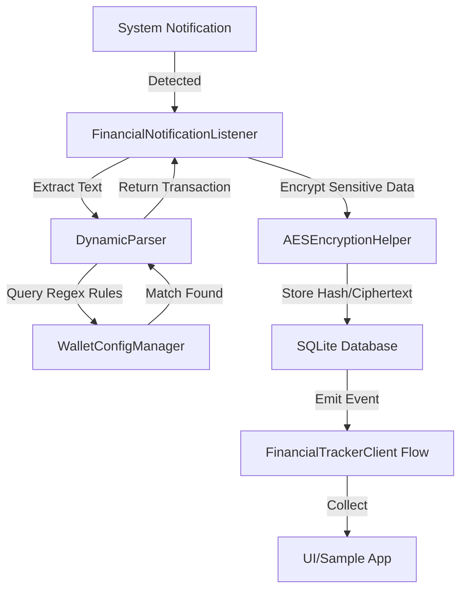

# Technical Architecture

The Smart Financial Tracker is built on a modular, event-driven architecture designed for high security and low latency.

## High-Level Flow

## Key Components

### 1. Notification Listener Service
Extends `NotificationListenerService`. It runs in the background and filters notifications based on package names defined in our configuration.

### 2. Dynamic Parser Engine
The core of the library. It uses "Named Capturing Groups" in regex to extract fields like `amount`, `currency`, and `counterpart`. This allows the library to adapt to new notification formats without a code update.

### 3. Security Layer (AES-256)
- **Encryption**: All PII (Personally Identifiable Information) and financial values are encrypted using AES/GCM before hitting the disk.
- **Hashing**: Reference IDs are hashed using SHA-256 to allow for deduplication without storing the original ID in plain text.

### 4. Client API (Kotlin Coroutines)
Exposes data via `SharedFlow`, making it "reactive". UI components can simply collect the flow to get real-time updates.
